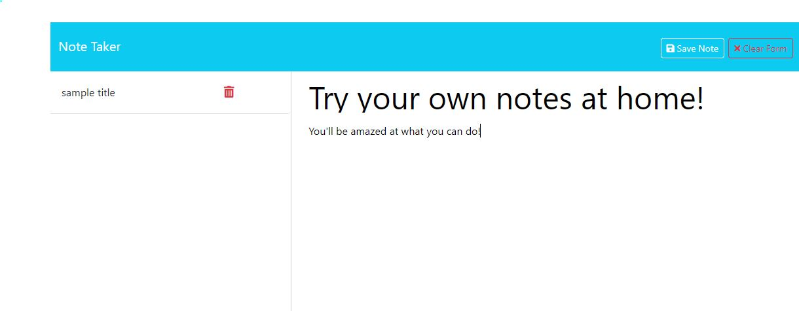

# Note-taker

## Description

step right up to the mystical and mystifying note taker app! Don't let your eyes decieve you: some may think this may have been built on front end functions and local storage, but that's where youre wrong! clear your caches and storage and be amazed! all your most important notes are still saved on our server provided by heroku.

But buyers beware; while front end code has been provided to allow the deletetion of your unneeded notes, no such functionality yet exists on the server side.

Github repo: https://github.com/aalyman42/Note-taker

Heroku deployment: https://note-taker-aalyman-ef38fc488bb3.herokuapp.com

## Source Code & refrences

    Source code provided by coding bootcamp, including public folder, db folder, and package.json.

    source code found here: https://github.com/coding-boot-camp/miniature-eureka

    reference for post request structure in bootcamp unit 11 mini project.

    guidance toward creating a promisify fs.readfile from Jenny Nguyen.

## Screenshot

